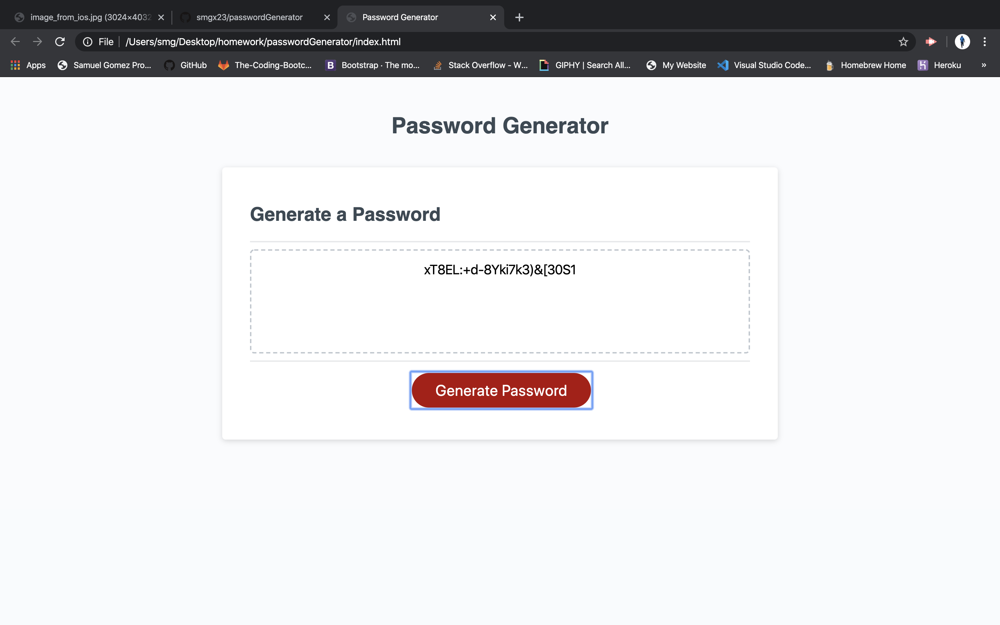

# passwordGenerator

//Title (unique not homeworking)
description of functionality
link of deployed site
screenshots of deployed site.

Read me:

TITLE: " Saltus Verbum"

The user will input the following;
1. Click on the generate password button.
2. Pick the amount of characters they want
3. Then they pick if they want special characters, numbers, upper or lower case letters. 
4. Then the programm generates the passoword and displays it for user on screen.

Link:  https://smgx23.github.io/passwordGenerator/

